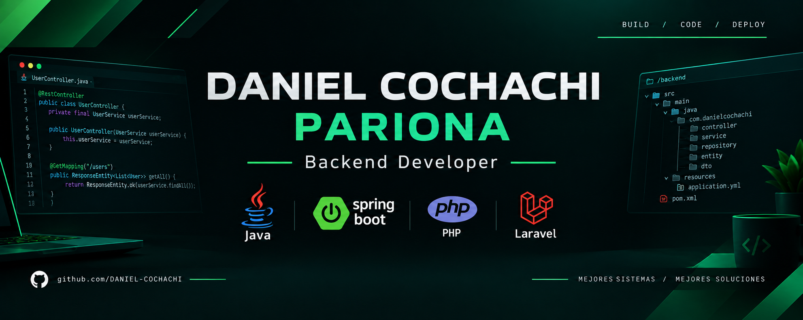
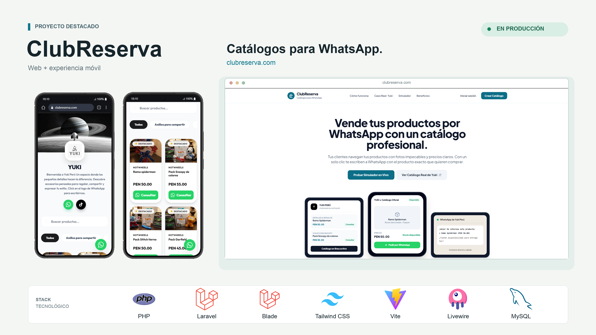
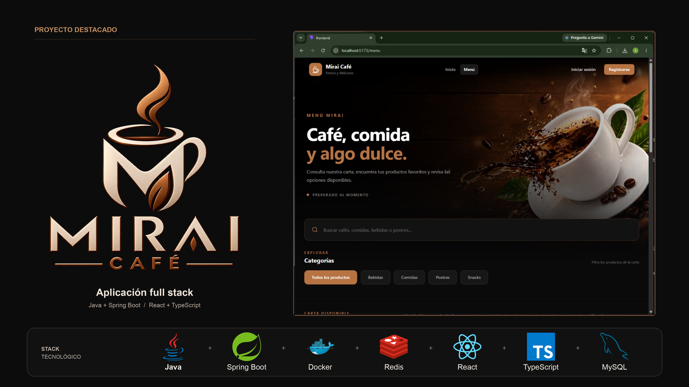

<h1 align="center">Hola, soy Daniel Cochachi 👋</h1>

  

  
  
  
  

## Sobre mí

- 🎓 Estudiante de Computación e Informática en Cibertec · Perú
- 🚀 Creador de **ClubReserva**, un SaaS de catálogos para WhatsApp en producción
- ☕ Backend con **Java y Spring Boot**: APIs REST, JWT, JPA/Hibernate y MySQL
- 🐘 Backend con **PHP y Laravel**, y frontend con **React y TypeScript**
- 🌐 Sitios web para negocios locales con Astro y JavaScript
- 🤖 Uso IA como asistente de desarrollo: **Antigravity, Claude, Gemini y DeepSeek**
- 🔎 Busco mi primera oportunidad: **prácticas o puesto junior** como desarrollador backend

## Proyectos destacados

<table>
  <tr>
    <td align="center" width="50%">
      <h3>ClubReserva · SaaS en producción</h3>
      
       
      
      
        
      Plataforma SaaS donde cada negocio publica su <b>catálogo web</b> y recibe pedidos estructurados en su <b>WhatsApp</b>, sin comisiones por venta. Incluye panel de administración y un catálogo real en producción con más de 60 productos.
        
      PHP · Laravel · Livewire · React · MySQL
       
      🔒 Código privado (producto en producción) · disponible para revisar en entrevista
    </td>
    <td align="center" width="50%">
      <h3>Mirai Café · Fullstack</h3>
      
       
      
      
        
      Sistema web para una cafetería, desarrollado en equipo: <b>autenticación con JWT y roles</b> (<code>ADMIN</code>, <code>CAJERO</code>, <code>CLIENTE</code>), gestión de productos e inventario de insumos, y API documentada con <b>Swagger</b>. Frontend en <b>React con TypeScript</b>.
        
      Java 21 · Spring Boot 3 · Spring Security · JPA · MySQL · React · TypeScript · Vite · TailwindCSS
    </td>
  </tr>
</table>

Más proyectos en mis [repositorios](https://github.com/Daniel-Cochachi?tab=repositories).

## Stack

  

  
  
  
  

- **Backend:** Java 17/21, Spring Boot, Spring Security (JWT), Spring Data JPA / Hibernate, PHP, Laravel, Livewire
- **Frontend:** React, TypeScript, Vite, TailwindCSS, JavaScript, HTML, CSS, Astro
- **Datos:** MySQL, SQL Server
- **Herramientas:** Git, GitHub, Maven, Postman, Swagger, IntelliJ IDEA, VS Code
- **IA:** Antigravity, Claude, Gemini, DeepSeek

## Contacto

- Email: [daniel.cochachi.pariona@gmail.com](mailto:daniel.cochachi.pariona@gmail.com)
- Portafolio: [daniel-cochachi.github.io/Portafolio-Daniel-Cochachi](https://daniel-cochachi.github.io/Portafolio-Daniel-Cochachi/)
- LinkedIn: [linkedin.com/in/daniel-armando-cochachi-pariona-482672397](https://www.linkedin.com/in/daniel-armando-cochachi-pariona-482672397)
